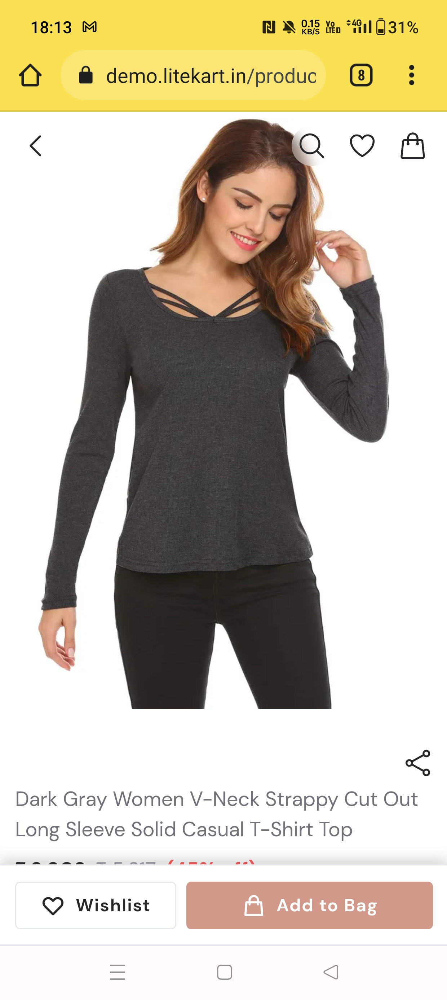
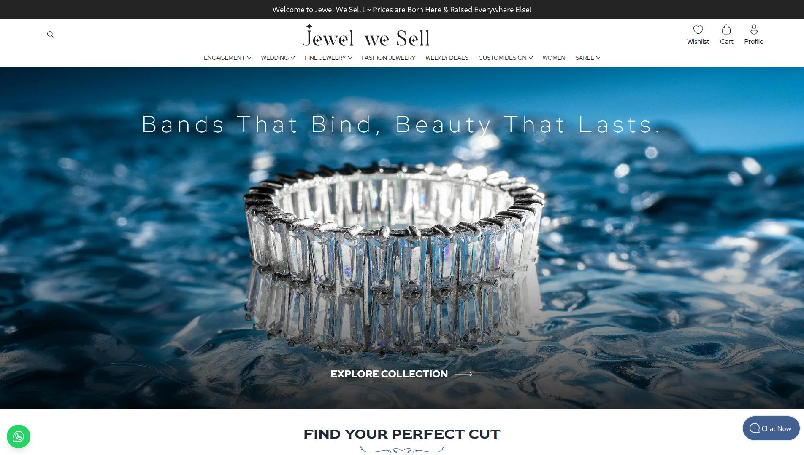
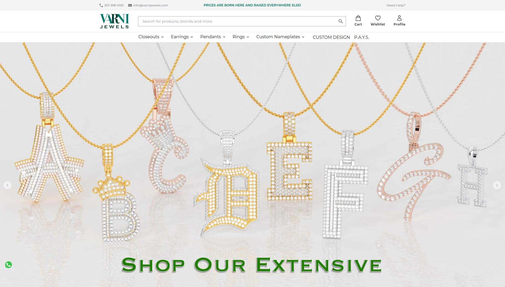
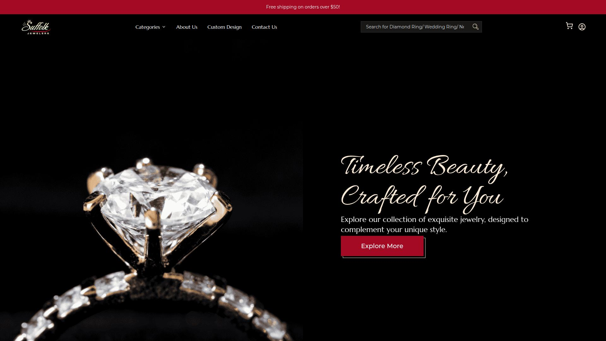

<div align="center">
<h2>Svelte Commerce</h2>
</div>

<div align="center">

**The open-source frontend for any eCommerce. Built with a headless approach, using a modern JS stack. We have WIP for MedusaJS, Shopify. The API approach also allows you to merge Svelte Commerce with any third-party tool like payment gateways, POS or AI.**

</div>

<div align="center">
  <br>
    
    
</div>

<br>
<p align="center">



</p>

<br/>
<h2 align="center"> Premium themes made using svelte-commerce </h2>
<p align="center">


<br>
<br>


</p>

<br/>
<p align="center">
  <br/><br/>
  
	<a href="https://github.com/itswadesh/svelte-commerce/stargazers" target="_blank">
		</a>
	<a href="https://github.com/itswadesh/svelte-commerce/issues" target="_blank">
		</a>
  <a href="https://t.me/itswadesh" target="_blank">
    </a>
</p>

<br/>
<p align="center">
  <a href="https://github.com/itswadesh/svelte-commerce/discussions/new/choose" target="_blank">
    
  </a>
  <a href="https://discord.gg/GgdAeccwDR" target="_blank">
    
  </a>
  <a href="https://twitter.com/itswadesh" target="_blank">
    
  </a>
  <a href="https://reddit.com/u/itswadesh" target="_blank">
    
  </a>
</p>

<p align="center">
Reach out to me with queries!
</p>
<br/>
<br/>

<div align="">

</div>
<br/>
<h2 class="text-center text-sm font-semibold text-gray-600">TRUSTED BY TEAMS AROUND THE WORLD</h2> 
<p>


</p>
<br/>

## What is it?

- Svelte Commerce is a PWA storefront for your existing eCommerce based on Sveltekit.
- It is possible to connect with any eCommerce backend that provides an API
- We are working on adaptors of Medusajs, Shopify

## Features

- 👨🏻‍💻 Its both SSR and SPA
- 🚀 Superfast
- 🔗 It is possible to connect with any eCommerce backend if the backend has Rest API
- 🔓 Svelte Commerce is free and open source. Download and modify it the way you want
- 🛒 Most of the essential features for ecommerce are already integrated
- 💰 No need to make a big leap or invest huge amount. Just take this opend source project and attach to existing backend.

## Get Started

```
git clone https://github.com/itswadesh/svelte-commerce.git
cd svelte-commerce
npm i
npm run dev
```

Thats all !

Open http://localhost:3000 on chrome. Your app should be live with awesome svelte-commerce up and running

## Development
run `npm link` inside `litekart-utils` repo
run `npm link @misiki/litekart-utils` inside this repo
run `npm link` inside `litekart-connector` repo
run `npm link @misiki/litekart-connector` inside this repo

## Configuration

There are 3 places to configure

1. `src/lib/config/`
   All non secret and application wide configs are stored here. If required, change according to your requirement.

2. `.env`
   All secrets stored here

3. `src/lib/services/index.ts`
   This is used to define which service to use. Only 1 of the listed service can be active at a time. Valid values are
   - `export * from '@misiki/litekart-connector'`
   - `export * from '@misiki/medusa-connector'`

## Deployment

Click on the button to directly deploy to Netlify or Vercel. Zero configuration required.

<a href="https://app.netlify.com/start/deploy?repository=https://github.com/itswadesh/svelte-commerce" aria-label="Click to deploy into netlify">

</a>

[](https://vercel.com/new/clone?repository-url=https%3A%2F%2Fgithub.com%2Fitswadesh%2Fsvelte-commerce&env=PUBLIC_LITEKART_DOMAIN&envDescription=arialshop.com)

The following envirnoment variable is mandatory

```
PUBLIC_LITEKART_DOMAIN=arialshop.com
PUBLIC_LITEKART_API_URL=https://api.litekart.in
```

You can replace the env variable with your store domain

### Docker

We also support docker images, use the following command to pull the latest docker image and deploy it:

```sh
docker run -d -p 3000:3000 ghcr.io/itswadesh/svelte-commerce:latest
```

## Features

<!-- If you like the ideas behind Svelte Commerce and want to become a contributor - [join github discussions](https://github.com/itswadesh/svelte-commerce/discussions/new/choose), check the list of the [active issues](https://github.com/itswadesh/svelte-commerce/issues) or contact me directly via hi@litekart.in -->

Svelte ecommerce - Headless, Authentication, Cart & Checkout, TailwindCSS, Server Rendered, Proxy + API Integrated, Animations, Lazy Loading, Loading Indicators, Carousel, Instant Search, Faceted Filters, Open Source

## Updates

For a complete development story, visit [our development page](https://litekart.in/development-story)
