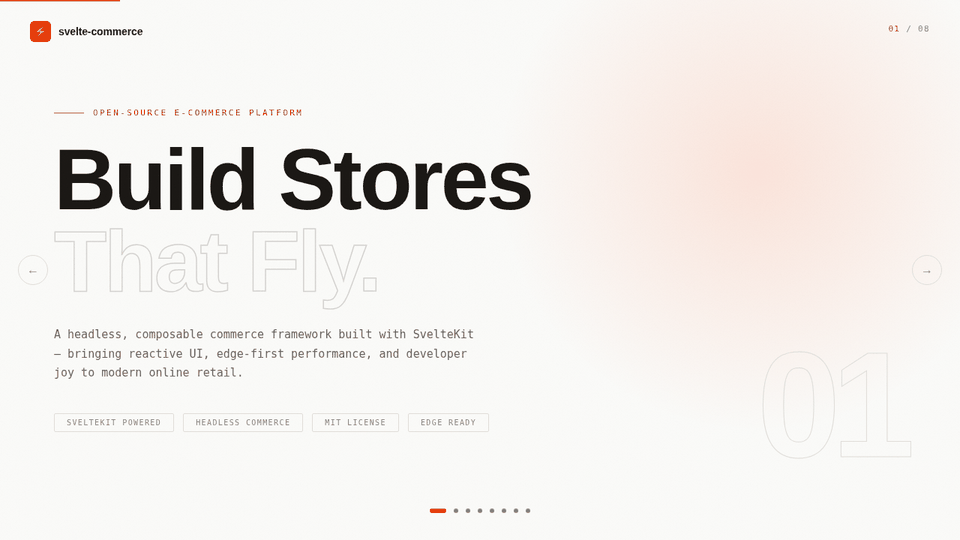
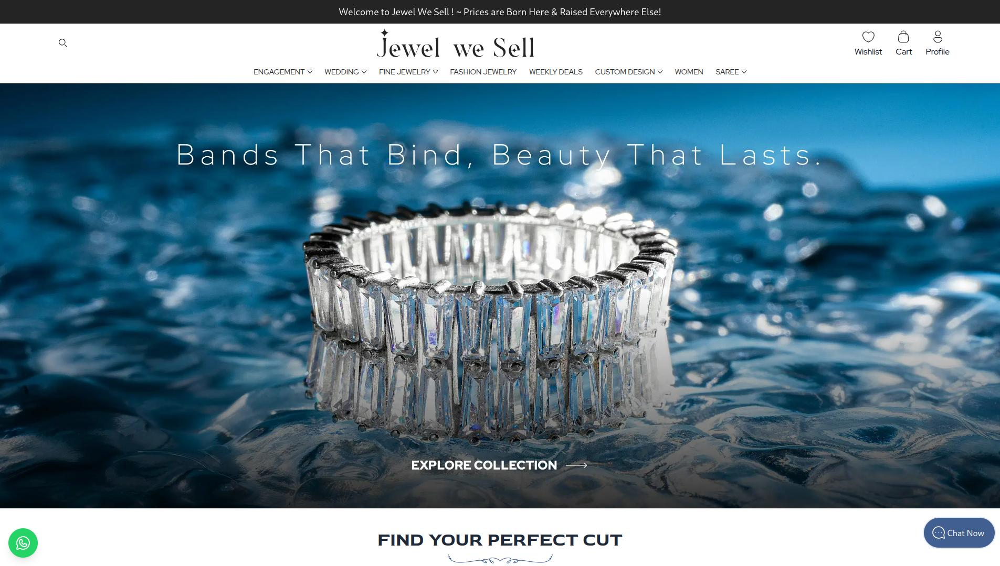

<div align="center">
<h2>Svelte Commerce</h2>
</div>

<div >

**The open-source frontend for any eCommerce. Built with a headless approach, using a modern JS stack. The API approach also allows you to merge Svelte Commerce with third-party payment gateways and analytics tools.**

## Backend support

Svelte Commerce talks to any backend through a connector package. Nothing in the app
imports a connector by name — every service resolves through `$lib/core/services`, which follows
whatever `kitcommerce.config.ts` exports. So switching backends is one export change:

```ts
// pick exactly one
export * as services from "@misiki/shopify-connector"
// export * as services from "@misiki/litekart-connector"
// export * as services from '@misiki/medusa-connector'
// export * as services from '@misiki/vendure-connector'
// export * as services from '@misiki/saleor-connector'
// export * as services from '@misiki/commercetools-connector'
// export * as services from '@misiki/woocommerce-connector'
```

`package.json` ships `@misiki/litekart-connector` as the stock connector. Replace it with the one
you picked above so `npm i` — and any Docker build, which installs from `package.json` alone —
resolves the connector your storefront actually talks to:

```sh
npm uninstall @misiki/litekart-connector
npm i @misiki/medusa-connector   # or vendure, saleor, ...
```

That is the only change needed. `@misiki/kitcommerce-core` imports `@misiki/litekart-connector` by
name — it is a peerDependency of that package — so two shims redirect that one specifier onto the
connector you installed: a resolver plugin in `vite.config.ts` for the runtime/bundling layer, and
an ambient declaration written by `sync-connector-types.js` (run by `npm run check`) for the type
layer. Both read `package.json`, so installing your connector is all it takes; neither does anything
when Litekart is the installed connector.

## All 26 connectors — and a request to the people who build these platforms

Each connector maps one platform's API onto a shared 43-service surface (`product`, `cart`,
`checkout`, `order`, `auth`, `address`, …). Coverage below is **measured, not asserted**: a script
traces which services actually reach the HTTP layer, following each connector's own request helpers.

Every endpoint was written by reading the platform's **authoritative source** — the OpenAPI spec,
the RAML, the router registration, or the controller code itself. We did not guess routes, and
where a route could not be verified we left an explicit placeholder rather than ship a
plausible-looking path that 404s in a merchant's store.

**But none of these have been run against a live production instance.** That is the single biggest
gap, and the one thing platform maintainers can fix that we cannot.

| Platform | npm package | Coverage | Cart | Checkout | Order | Auth | Help wanted with |
| :--- | :--- | :--- | :-: | :-: | :-: | :-: | :--- |
| [Litekart](https://litekart.in) | `@misiki/litekart-connector` | **39/43** | ✅ | ✅ | ✅ | ✅ | — |
| [Vendure](https://www.vendure.io) | `@misiki/vendure-connector` | **39/43** | ✅ | ✅ | ✅ | ✅ | — |
| [Medusa](https://medusajs.com) | `@misiki/medusa-connector` | **31/43** | — | ✅ | ✅ | ⛔ | address, auth, cart, category, payment-method, product, search, user |
| [Broadleaf Commerce](https://www.broadleafcommerce.com) | `@misiki/broadleaf-connector` | **28/43** | ✅ | ✅ | ✅ | ✅ | — |
| [Saleor](https://saleor.io) | `@misiki/saleor-connector` | **28/43** | — | — | — | ⛔ | address, auth, cart, category, checkout, coupon, order, page, payment-method, search, user |
| [Shopware](https://www.shopware.com) | `@misiki/shopware-connector` | **28/43** | ✅ | ✅ | ✅ | ✅ | coupon |
| [Virto Commerce](https://virtocommerce.com) | `@misiki/virto-connector` | **28/43** | ✅ | ✅ | ✅ | ✅ | — |
| [WooCommerce](https://woocommerce.com) | `@misiki/woocommerce-connector` | **27/43** | ✅ | ✅ | ✅ | ⛔ | auth, wishlist |
| [Magento Open Source](https://business.adobe.com/products/magento/open-source.html) | `@misiki/magento-connector` | **26/43** | ✅ | ✅ | ✅ | ✅ | review, wishlist |
| [Spree Commerce](https://spreecommerce.org) | `@misiki/spree-connector` | **26/43** | ✅ | ✅ | ✅ | ✅ | review |
| [X-Cart](https://www.x-cart.com) | `@misiki/x-cart-connector` | **26/43** | ✅ | ✅ | ✅ | ✅ | vendor |
| [EverShop](https://evershop.io) | `@misiki/evershop-connector` | **25/43** | ✅ | ✅ | ✅ | ✅ | review, vendor, wishlist |
| [Spryker](https://spryker.com) | `@misiki/spryker-connector` | **25/43** | ✅ | ✅ | ✅ | ✅ | coupon |
| [nopCommerce](https://www.nopcommerce.com) | `@misiki/nopcommerce-connector` | **24/43** | ✅ | ✅ | ✅ | ✅ | coupon, currency |
| [PrestaShop](https://prestashop.com) | `@misiki/prestashop-connector` | **24/43** | ✅ | ✅ | ✅ | ⛔ | auth, payment-method, review, wishlist |
| [Sylius](https://sylius.com) | `@misiki/sylius-connector` | **24/43** | ✅ | ✅ | ✅ | ✅ | page, vendor, wishlist |
| [Swell](https://www.swell.is) | `@misiki/swell-connector` | **23/43** | ✅ | ✅ | ✅ | ✅ | review, state, vendor, wishlist |
| [Bagisto](https://bagisto.com) | `@misiki/bagisto-connector` | **22/43** | ✅ | ✅ | ✅ | ✅ | coupon, page, payment-method, vendor |
| [commercetools](https://commercetools.com) | `@misiki/commercetools-connector` | **21/43** | ✅ | ✅ | ✅ | ✅ | country, currency, page, vendor |
| [OroCommerce](https://oroinc.com) | `@misiki/orocommerce-connector` | **21/43** | ✅ | ✅ | ✅ | ✅ | currency, review, vendor, wishlist |
| [Sharetribe](https://www.sharetribe.com) | `@misiki/sharetribe-connector` | **21/43** | — | ✅ | ✅ | ✅ | address, cart, country, coupon, state, wishlist |
| [CS-Cart](https://www.cs-cart.com) | `@misiki/cs-cart-connector` | **20/43** | ✅ | ✅ | ✅ | ⛔ | address, auth, country, coupon, currency, state, wishlist |
| [Shuup](https://www.shuup.com) | `@misiki/shuup-connector` | **19/43** | ✅ | ✅ | ✅ | ✅ | country, coupon, page, review, state, wishlist |
| [Shopify](https://www.shopify.com) | `@misiki/shopify-connector` | **16/27** | ✅ | ✅ | ✅ | ✅ | country, page, profile, review, vendor, wishlist |
| [Django Oscar](https://github.com/django-oscar/django-oscar) | `@misiki/oscar-connector` | **15/43** | ✅ | ✅ | ✅ | ✅ | coupon, currency, page, payment-method, review, search, state, vendor, wishlist |
| [OpenCart](https://www.opencart.com) | `@misiki/opencart-connector` | **9/43** | ✅ | ✅ | ✅ | ⛔ | address, auth, category, coupon, page, profile, search, user, vendor, wishlist |

✅ wired · ⛔ throws `NotSupportedError` — the platform has no real endpoint, and a stub that
mints a session for any password is an auth bypass, not a placeholder · — not yet wired

**A low number is often the correct answer, not a to-do.** OpenCart core ships exactly ten API
controllers — cart, coupon, currency, customer, login, order, payment, reward, shipping, voucher —
and no product, category or search controller at all. Its 9/43 is the honest ceiling for that API.
Services excluded from "help wanted" are Litekart-native concepts (`reels`, `deals`, `chat`,
`gallery`, `popularity`, `banner`, …) that have no equivalent on any third-party platform.

### 📣 How you can help

If you build or maintain one of these platforms, in priority order:

1. **A sandbox or demo instance we can point a storefront at.** Even short-lived. Worth more than
   any code review — it turns "verified against the spec" into "verified against reality".
2. **Ten minutes telling us our idioms are wrong.** We picked one way to do pagination, filtering,
   sorting and session handling per platform. If it is not how you would do it, saying so saves us
   a wrong assumption baked into every service.
3. **Answers on the gaps above.** Most are "does this platform have X at all?" — instant for you,
   guesswork for us.
4. **A pointer to the right docs.** Three URLs we were given were dead (`spree.readthedocs.io`,
   `api.sylius.com`, django-oscar-api's route page) and we fell back to reading source.

Per-platform open questions are in **[CONNECTORS.md](./CONNECTORS.md#per-platform-notes-and-what-wed-like-to-ask-you)** —
e.g. does Shopware's Store API have standalone voucher lookup? Is REST planned for
`Magento_Review`/`Magento_Wishlist`, which ship no `webapi.xml`? Is `listing → Product` the mapping
Sharetribe would recommend?

Open an issue or PR on the connector repo under [github.com/misiki-in](https://github.com/misiki-in),
or start a [discussion](https://github.com/itswadesh/svelte-commerce/discussions/new/choose).
We will credit you in the connector README.

### Storefront capability matrix

| Capability                    | Litekart | Shopify | Medusa | Vendure | Saleor | WooCommerce |
| ----------------------------- | :------: | :-----: | :----: | :-----: | :----: | :---------: |
| Product listing / search      |    ✅    |    ✅   |   ✅   |   ✅    |   ✅   |      ✅     |
| Product detail page           |    ✅    |    ✅   |   ✅   |   ✅    |   ✅   |      ✅     |
| Categories / collections      |    ✅    |    ✅   |   ✅   |   ✅    |   ❓   |      ✅     |
| Cart                          |    ✅    |    ✅   |   ✅   |   ✅    |   ✅   |      ✅     |
| Checkout                      |    ✅    |    ✅   |   ✅   |   ✅    |   ✅   |      ✅     |
| Payment methods               |    ✅    |    ✅   |   ✅   |   ✅    |   ✅   |      ✅     |
| Order placement               |    ✅    |    ✅   |   ✅   |   ✅    |   ✅   |      ✅     |
| Order history / detail        |    ✅    |    ✅   |   ✅   |   ✅    |   ✅   |      ✅     |
| Auth / registration           |    ✅    |    ✅   |   ✅   |   ✅    |   ✅   |      ✅     |
| Addresses                     |    ✅    |    ✅   |   ✅   |   ✅    |   ✅   |      ✅     |
| Customer profile              |    ✅    |    ✅   |   ✅   |   ✅    |   ✅   |      ✅     |
| Wishlist                      |    ✅    |    ❓   |   ❓   |   ❌    |   ❓   |      ❓     |
| Reviews                       |    ✅    |    ❓   |   ❓   |   ❌    |   ❓   |      ❓     |
| Coupons / promotions          |    ✅    |    ❓   |   ❓   |   ❌    |   ❓   |      ❓     |
| Multi-currency / regions      |    ✅    |    ✅   |   ❓   |   ❌    |   ❓   |      ❓     |
| Faceted search (Meilisearch)  |    ✅    |    ✅   |   ✅   |   ❌    |   ✅   |      ✅     |
| CMS pages, blog, banners, FAQ |    ✅    |    ❓   |   ❓   |   ❌    |   ❌   |      ❓     |
| Multi-vendor / marketplace    |    ✅    |    ✅   |   ❌   |   ❌    |   ❌   |      ❓     |

✅ supported · ❌ not implemented yet · ❓ untested

> Litekart is the reference implementation and is the most complete. The Medusa, Vendure
> and Saleor connectors cover the core commerce path — browse, product, cart, checkout,
> order — and are actively being extended. PRs welcome.

> **Maintainers of these platforms:** we would rather ask than guess. The fastest way to help is
> a sandbox instance we can point a storefront at, or ten minutes telling us our endpoint idioms
> are wrong. Specific open questions per platform are in
> [CONNECTORS.md](./CONNECTORS.md#per-platform-notes-and-what-wed-like-to-ask-you).

### Required backend settings

Each backend needs a few settings changed before the storefront will work end to end.

**Vendure**

- `authOptions.requireVerification` → `false`

See [VENDURE.md](./VENDURE.md) for the full Vendure setup guide (env, store identity,
architecture, limitations, troubleshooting).

**Saleor**

- Require email confirmation for user registration → `false`
- `isPhoneMandatory` → `false`
- Allow unpaid orders in **order settings** → enabled
- Allow unpaid orders in **channel settings** → enabled

See [SALEOR.md](./SALEOR.md) for the full Saleor setup guide.

**Medusa**

- Set a publishable API key and add your storefront origin to the Store CORS config.

See [MEDUSA.md](./MEDUSA.md) for the full Medusa setup guide.

### Demos

| Backend  | Demo                |
| :------- | :------------------ |
| Litekart | https://arialshop.com/ |
| Medusa   | _add URL_           |
| Vendure  | _add URL_           |
| Saleor   | _add URL_           |

</div>

<div align="center">
  <br>
    
</div>

<div align="center">
  <br>
    
    
</div>

<br>
<p align="center">


</p>

<br/>
<h2 align="center"> Premium themes made using svelte-commerce </h2>
<p align="center">


<br>
<br>


</p>

<br/>
<p align="center">
  <br/><br/>
  
	<a href="https://github.com/itswadesh/svelte-commerce/stargazers" target="_blank">
		</a>
	<a href="https://github.com/itswadesh/svelte-commerce/issues" target="_blank">
		</a>
  <a href="https://t.me/itswadesh" target="_blank">
    </a>
</p>

<br/>
<p align="center">
  <a href="https://github.com/itswadesh/svelte-commerce/discussions/new/choose" target="_blank">
    
  </a>
  <a href="https://discord.gg/GgdAeccwDR" target="_blank">
    
  </a>
  <a href="https://twitter.com/itswadesh" target="_blank">
    
  </a>
  <a href="https://reddit.com/u/itswadesh" target="_blank">
    
  </a>
</p>

<p align="center">
Reach out to me with queries!
</p>
<br/>
<br/>

<div align="">

</div>
<br/>

## What is it?

- Svelte Commerce is a PWA storefront for your existing eCommerce based on SvelteKit.
- It is possible to connect with any eCommerce backend that provides an API.
- We are working on adapters for Medusa, Shopify, and WooCommerce.

## Features

- 👨🏻‍💻 It's both SSR and SPA
- 🚀 Superfast
- 🔗 It is possible to connect with any eCommerce backend if the backend has a REST API
- 🔓 Svelte Commerce is free and open source. Download and modify it the way you want
- 🛒 Most of the essential features for eCommerce are already integrated
- 💰 No need to make a big leap or invest a huge amount. Just take this open source project and attach it to your existing backend.

## Get Started

```
git clone https://github.com/itswadesh/svelte-commerce.git
cd svelte-commerce
npm i
npm run dev
```

That's all!

Open http://localhost:3000 on Chrome. Your app should be live with awesome svelte-commerce up and running

## Configuration

There is 1 place to configure

1. `kitcommerce.config.ts`
   This is used to define which service to use. Only 1 of the listed services can be active at a
   time — install that connector in `package.json` in place of `@misiki/litekart-connector`. Valid
   values are:
   - `export * as services from "@misiki/shopify-connector"`
   - `export * as services from "@misiki/litekart-connector"`
   - `export * as services from '@misiki/medusa-connector'`
   - `export * as services from '@misiki/vendure-connector'`
   - `export * as services from '@misiki/saleor-connector'`
   - `export * as services from '@misiki/commercetools-connector'`
   - `export * as services from '@misiki/woocommerce-connector'`

## Deployment

Click on the button to directly deploy to Netlify or Vercel. Zero configuration required.

<a href="https://app.netlify.com/start/deploy?repository=https://github.com/itswadesh/svelte-commerce" aria-label="Click to deploy into netlify">

</a>

[](https://vercel.com/new/clone?repository-url=https%3A%2F%2Fgithub.com%2Fitswadesh%2Fsvelte-commerce&env=PUBLIC_LITEKART_DOMAIN)

The following environment variables are mandatory:

```
PUBLIC_LITEKART_DOMAIN=arialshop.com
PUBLIC_LITEKART_API_URL=https://api.litekart.in
```

You can replace the env variable with your store domain

### Docker

We also support docker images, use the following command to pull the latest docker image and deploy it:

```sh
docker run -d -p 3000:3000 ghcr.io/itswadesh/svelte-commerce:latest
```
